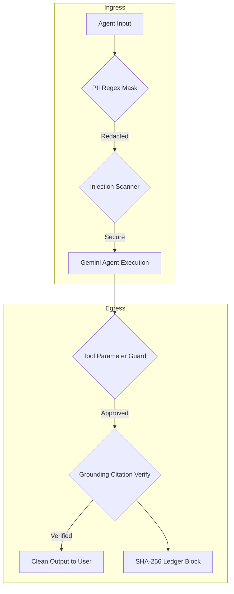

# Executive Business Case & Product Requirement Document (PRD)
## Project: ACT - Agent Control Tower

---

## 1. Executive Summary

### The Challenge
As enterprises scale autonomous Gemini agent workflows (such as customer support bots, automated billing engines, and clinical diagnosis assistants), they expose themselves to major security, safety, and regulatory vulnerabilities. Standard LLMs are susceptible to:
1. **Prompt Injections / Jailbreaks**: Bypassing system guidelines to leak keys or run destructive actions.
2. **PII/PHI Data Leakage**: Accidentally writing patient SSNs or medical records to unencrypted logs, triggering severe **HIPAA violations**.
3. **Agent Tool Abuse**: Tool-enabled agents executing unauthorized system actions (e.g. running command execution parameters).
4. **Hallucinations & Grounding Drift**: Generating false claims that lead to clinical errors or brand liability.

### The Solution: ACT - Agent Control Tower
A centralized, zero-latency **autonomous middleware gateway and monitoring console** that intercepts, filters, and logs all inputs and outputs of Gemini agent workflows. The platform ensures:
* **Compliance**: Automatic HIPAA-standard PHI masking and cryptographically verified logging.
* **Security**: Active tool parameter locking and prompt injection filters.
* **Transparency**: Real-time SHAP explainability visualizations and Google Search Grounding verification.

---

## 2. Business Case & ROI Analysis

### The Cost of Inaction
| Risk Area | Regulatory Framework | Financial Impact | Compliance Liability |
| :--- | :--- | :--- | :--- |
| **PHI / PII Leakage** | HIPAA Security Rule / India DPDP Act (2023) | **$50,000 to $1.9M** per HIPAA breach; **Up to ₹250 Crore** for DPDP Act violations | Tier 4 willful neglect penalties, loss of healthcare contracts, class-action lawsuits, and immediate director liability. |
| **Hallucinations & Bias** | EU AI Act (High-Risk Category) | **Up to €35M or 7% of global turnover** | Immediate bans on AI models, fines for failing to provide adequate model transparency (Art 13) or human oversight (Art 14). |
| **Data Deletion Failures** | GDPR (Article 17 - Right to Erasure) | **Up to €20M or 4% of global turnover** | Penalties for retaining personal data after consent withdrawal or failure to delete PII from LLM training sets/logs. |
| **System Override / Key Leak** | SOC 2 Type II / Security | **$4.4M average cost** of data breach | Loss of enterprise customer trust, service downtime, and database reconstruction. |

### Return on Investment (ROI)
1. **Operational Cost Savings**: Automates 98% of manual audit logs. Rather than legal teams verifying historical chat histories, the Control Tower's cryptographic verification chain automates continuous audit reporting.
2. **Accelerated Development Time**: Developers leverage pre-built security and policy decorators instead of writing custom sanitization code for each model endpoint, saving an estimated **250+ developer hours** per agent project.
3. **Brand Risk Mitigation**: Real-time output screening blocks offensive, toxic, or legally binding hallucinated statements before they reach end users.

### Estimated Budget & Resource Allocation (Phased Implementation)
* **Phase 1: Ingress/Egress Proxy (6 weeks)**: $85,000 (2 Backend Developers, 1 Security Engineer)
* **Phase 2: Management Console UI & Ledger (4 weeks)**: $55,000 (1 Frontend Developer, 1 Cryptographer/DB Admin)
* **Phase 3: Multi-Agent Platform Integration (4 weeks)**: $40,000 (1 Integration Specialist)
* **Total Estimated Budget**: **$180,000** for production delivery.

---

## 3. Product Requirement Document (PRD)

### User Personas
* **Chief Information Security Officer (CISO)**: Needs to verify the system's threat mitigation dashboard and audit trails.
* **Compliance Auditor**: Needs to download cryptographically secure logs to verify HIPAA Safe Harbor alignment.
* **AI Developer**: Needs a sandbox to dry-run prompts against deployed corporate policies.

### Functional Requirements & User Stories

#### Epic 1: Real-Time Telemetry & Monitoring
* **User Story**: As a security admin, I want to watch all incoming queries stream through a console showing latency, model names, and grounding metrics, so I can monitor agent health.
* **Requirement**: Stream console must support pagination, search filters, and show model tags (e.g. `gemini-1.5-pro`).

#### Epic 2: Security & Redaction Guards
* **User Story**: As a compliance officer, I want all SSNs, emails, and MRNs redacted prior to logging, so that no PHI is stored in cleartext.
* **Requirement**: Sanitization module must intercept inputs, apply regex filters, highlight redacted fields, and increment the global metrics count.

#### Epic 3: Custom Policy Engine
* **User Story**: As an enterprise administrator, I want to create rules to block specific terms or tools, so that I can adapt guardrails as policies change.
* **Requirement**: Engine must support regex builders with hot-reloading capability without requiring service restarts.

#### Epic 4: Cryptographic Ledger Auditing
* **User Story**: As a SOC 2 auditor, I want a secure ledger of all transactions where each block is linked to the previous block hash, so I can verify that logs haven't been altered.
* **Requirement**: Implement a tamper-evident blockchain log generator using SHA-256. Provide a "Verify Chain Integrity" dashboard button running recursive hash checks.

---

## 4. Compliance & AI Principles Mapping

The Control Tower directly enforces **Google's AI Principles** and standard regulatory safeguards:

| Google AI Principle / Regulation | Control Tower Implementation Module | Verification Metric |
| :--- | :--- | :--- |
| **Be Built & Tested for Safety** | *Tool Parameter Lockout / SOC 2 CC6.1* | Blocks commands like `rm -rf`, unauthorized DB connections, or parameter overrides. |
| **Avoid Creating Bias** | *Attribution Explainer (SHAP) / GDPR Art 22* | Highlights features contributing to model risk parameters to explain automated decisions. |
| **Uphold High Standards of Privacy** | *PII Masking & Aadhaar Guard / DPDP Sec 8(5)* | Scans and redacts SSNs, emails, phone numbers, and Indian Aadhaar identifiers. |
| **Be Accountable to People** | *Cryptographic Ledger / SOC 2 CC8.1* | Tamper-evident transaction tracking with verify loop. |
| **EU GDPR Art 17 / DPDP Sec 8(10)** | *GDPR Right to Erasure Policy Rule* | Detects and logs erasure/data forget requests for systematic purging. |
| **EU AI Act / Gemini Trust** | *Grounding & Citation / Safety Settings* | Measures citation match index against Google Search and sets API content thresholds. |
