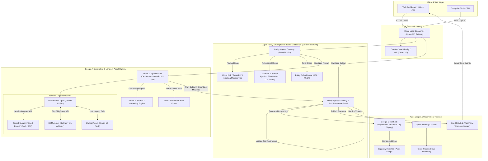

# High-Level Architecture & System Design Document (HLD)
## Transitioning Agent Policy and Compliance Tower to Google AI Ecosystem (Gemini Enterprise Agent Platform)

**Document Version:** 1.0  
**Author:** AI Governance & Agentic Security Engineering Team  
**Target Platform:** Google Cloud Platform (GCP) — Vertex AI, Gemini Enterprise Agent Platform, Cloud Run / GKE, Cloud DLP, Cloud KMS, BigQuery  
**Status:** PROPOSED ARCHITECTURE

---

## 1. Executive Summary & Architectural Vision

The **Agent Policy and Compliance Tower** is an enterprise-grade governance, security guardrail, and audit platform designed to oversee autonomous multi-agent systems. This High-Level Design (HLD) document defines the architectural blueprint for transitioning the interactive control tower prototype into a real-time, production-grade middleware and observability system built natively on the **Google AI Ecosystem**, specifically leveraging the **Gemini Enterprise Agent Platform** and **Vertex AI**.

### Core Objectives
1. **Zero-Trust Interception**: Intercept and evaluate 100% of inter-agent messages, human inputs, and tool calls before execution.
2. **Native Gemini Integration**: Seamlessly interface with Google Vertex AI SDKs (`google-genai`), Gemini 1.5 Pro / Flash models, Vertex AI Search Grounding, and Vertex Safety Filters.
3. **Multi-Framework Regulatory Compliance**: Enforce automated guardrails for **HIPAA**, **SOC 2 Type II**, **EU GDPR** (Art. 17 Right to Erasure), **India DPDP Act 2023** (Aadhaar redaction), and **Google Gemini Trust Platform** standards.
4. **Sub-25ms Guardrail Overhead**: Maintain ultra-low latency ingress/egress filtering via high-performance microservices (Go / FastAPI on Cloud Run).
5. **Cryptographically Verifiable Ledger**: Secure all transaction logs into a tamper-evident SHA-256 block chain signed via **Google Cloud KMS** and persisted to **BigQuery / Cloud Spanner**.

---

## 2. Enterprise Reference Architecture

The diagram below illustrates the end-to-end production architecture deployed on Google Cloud Platform, connecting client applications, the Policy Tower Gateway, the Vertex AI Agent Builder runtime, external tools, and the cryptographic audit pipeline.



---

## 3. Component Deep-Dive & Google Native Bindings

### 3.1 Policy Ingress Gateway (Cloud Run / GKE)
- **Role**: Serves as the high-throughput front door for all agent interactions.
- **Implementation**: Deployed as containerized FastAPI (Python 3.11+) or Gin (Go) workers on Cloud Run with CPU allocation set to Always-On and autoscaling from 2 to 100 instances.
- **Ingress Filtering Pipeline**:
  1. **Pattern & Regex Scanner**: Executes lightning-fast local matching for sensitive IDs (e.g., Aadhaar card pattern `\b\d{4}-\d{4}-\d{4}\b`, US SSN `\b\d{3}-\d{2}-\d{4}\b`, and MRN strings).
  2. **Google Cloud DLP API Integration**: For deeper contextual entity recognition, calls Cloud DLP `projects.content.inspect` asynchronously with custom `InfoType` detectors (`INDIA_AADHAAR`, `MEDICAL_RECORD_NUMBER`, `PERSON_NAME`, `US_SOCIAL_SECURITY_NUMBER`).
  3. **Adversarial Injection Guard**: Evaluates prompt embeddings against a binary intent classification model to catch indirect prompt injection, systemic instruction overrides, and prefix escape attacks.

### 3.2 Gemini Enterprise Agent Platform & Multi-Agent Network
- **Orchestration Framework**: Built on **Vertex AI Agent Builder (Reasoning Engine)** using Python `vertexai.preview.reasoning_engines`.
- **Multi-Agent Network Components (Fusion AI Ecosystem)**:
  - **Orchestrator Agent (`sa:fusion-ai-orchestrator@gcp-project.iam`)**: Powered by `gemini-1.5-pro-002`. Manages ReAct loops, context assembly, multi-step planning, and agent delegating.
  - **TimesFM Forecasting Agent (`sa:fusion-ai-timesfm@gcp-project.iam`)**: Serves Google's **TimesFM 2.0** zero-shot foundation model deployed on Cloud Run with GPU support (NVIDIA T4/L4). Receives historical univariate time-series data and produces probabilistic demand predictions.
  - **BQML Analytics Agent (`sa:fusion-ai-bqml@gcp-project.iam`)**: Queries BigQuery ML `ARIMA_PLUS` models via BigQuery Storage API to fetch enterprise baseline forecasts and historical metrics.
  - **Chatbot Agent (`sa:fusion-ai-chatbot@gcp-project.iam`)**: Powered by `gemini-1.5-flash-002` for fast conversational interactions with internal operators and end-users.
- **Identity & Security**: Each agent operates under a dedicated Google Cloud Service Account bound via **Workload Identity Federation** and restricted with granular IAM roles (`roles/bigquery.jobUser`, `roles/aiplatform.user`).

### 3.3 Safety & Grounding Enforcement Engine
- **Vertex AI Safety Configuration**:
  The gateway dynamically maps UI threshold controls directly to `vertexai.generative_models.SafetySetting`:
  ```python
  from vertexai.generative_models import HarmCategory, HarmBlockThreshold, SafetySetting

  safety_settings = [
      SafetySetting(
          category=HarmCategory.HARM_CATEGORY_HARASSMENT,
          threshold=HarmBlockThreshold.BLOCK_LOW_AND_ABOVE,
      ),
      SafetySetting(
          category=HarmCategory.HARM_CATEGORY_HATE_SPEECH,
          threshold=HarmBlockThreshold.BLOCK_MEDIUM_AND_ABOVE,
      ),
      SafetySetting(
          category=HarmCategory.HARM_CATEGORY_DANGEROUS_CONTENT,
          threshold=HarmBlockThreshold.BLOCK_MEDIUM_AND_ABOVE,
      ),
  ]
  ```
- **Grounding Verification**:
  Uses `Tool.from_google_search_retrieval(google_search_retrieval=...)` or Vertex AI Search Data Stores. The Policy Egress Gateway extracts `grounding_metadata`, evaluates citation overlap scores against domain authority whitelists, and flags responses under the 85% confidence threshold as `UNGROUNDED_WARNING`.

### 3.4 Cryptographic Ledger & Audit Pipeline
- **Block Structure**:
  ```json
  {
    "block_id": 1428,
    "timestamp": "2026-07-20T19:38:21.000Z",
    "agent_id": "sa:fusion-ai-orchestrator",
    "prompt_hash": "a591a6d40bf420404a011733cfb7b190d62c65bf0bcda32b57b277d9ad9f146e",
    "response_hash": "c71e8432a524738520268593bc1d849204022a101b088e5d0e2e50529d675662",
    "policy_violations": ["DPDP-AADHAAR-REDACTED"],
    "prev_hash": "e3b0c44298fc1c149afbf4c8996fb92427ae41e4649b934ca495991b7852b855",
    "kms_signature": "MEUCIQD..."
  }
  ```
- **Cloud KMS Signing**:
  Each block is digested with SHA-256 and signed asynchronously using **Google Cloud KMS** Asymmetric Signing (`RSA_SIGN_PSS_2048_SHA256`).
- **Storage**:
  Signed blocks are written to an append-only BigQuery dataset (`ai_governance_audit.ledger_blocks`) with partition expiration locks and table access restricted exclusively to the `Auditor` IAM role.

---

## 4. Multi-Framework Regulatory Mapping Matrix

| Framework | Target Requirement | Engine Control Mechanism | GCP Service Binding |
| :--- | :--- | :--- | :--- |
| **HIPAA (US)** | §164.312(a)(1) Access Control & PHI Protection | Automated PHI entity redaction (MRN, SSN, Patient Names) before model ingress | Cloud DLP API + OPA Policy Engine |
| **SOC 2 Type II** | CC6.1 & CC6.8 Tamper-Proof Audit Logging | SHA-256 block chain signing & append-only storage | Cloud KMS + BigQuery Audit Ledger |
| **EU GDPR** | Art. 17 Right to Erasure & Art. 32 Encryption | Masking PII at rest and in flight; cryptographic key destruction for erasure | Cloud KMS + Cloud DLP De-identification |
| **India DPDP Act 2023** | Section 8 Notice & Consent / Aadhaar Redaction | Regex & Cloud DLP scanning for 12-digit Aadhaar patterns (`\b\d{4}-\d{4}-\d{4}\b`) | Custom Policy Interceptor + Cloud DLP |
| **Gemini Trust Platform** | Groundedness & Safety Standards | Automated grounding verification score calculation & safety threshold enforcement | Vertex AI Search Grounding + Safety Filters |

---

## 5. Non-Functional Specifications & Operations

### 5.1 Latency Budget Allocations
To ensure the Control Tower does not degrade real-time user experiences, the total guardrail latency budget is strictly capped at **25ms**:
- **Pattern & Regex Screening**: < 3ms
- **In-Memory Cache Lookup (Redis)**: < 2ms
- **Cloud DLP Asynchronous Inspection**: < 12ms
- **KMS Signing & Log Dispatch**: < 8ms (offloaded to async background thread worker)

### 5.2 Observability & Monitoring
- **OpenTelemetry Tracing**: Every agent request generates a trace ID (`traceparent` header) passed down to sub-agents (TimesFM, BQML, Chatbot). Spans are exported to **Google Cloud Trace**.
- **Real-Time Control Tower Telemetry**: Cloud Pub/Sub topics streaming live metric events (`governance.events`) connected via Server-Sent Events (SSE) to update the web control console in real time.

---

## 6. Implementation Plan & Next Steps

1. **Phase 1 (Infrastructure Setup)**: Provision Cloud Run services, Cloud DLP templates, Cloud KMS key rings, and BigQuery audit tables via Terraform.
2. **Phase 2 (Gateway SDK Integration)**: Implement `google-genai` SDK wrappers with embedded policy interceptors in Python/Go.
3. **Phase 3 (Vertex Agent Builder Integration)**: Wire Orchestrator, TimesFM, and BQML sub-agents into the Vertex AI Reasoning Engine environment.
4. **Phase 4 (Live Audit Verification)**: Run automated red-team simulations (prompt injections, PII leakage attempts) to validate end-to-end cryptographic block verification and real-time dashboard alerts.
