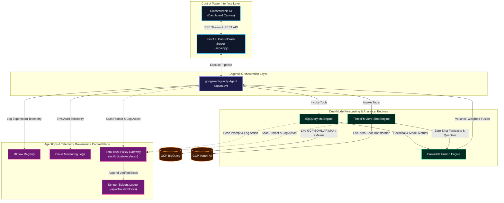

# Agentic Intelligence Hub & Compliance Control Tower

Agentic Intelligence Hub (Fusion AI): Designed an autonomous GCP-based agentic ecosystem integrating Gemini (Vertex AI), TimesFM, and Google ADK for multi-step reasoning and time-series forecasting; engineered containerized microservices on Cloud Run and BigQuery / BigQuery ML managed via GitHub, with full AgentOps, MLflow, OTEL, and Cloud Monitoring observability.

---

## 🛠️ Technology Stack & Role Assignments

Below is the complete engineering matrix of the Governance Control Plane and the Forecasting Ecosystem:

| Layer | Component | Technology / Stack | Purpose & Responsibility |
| :--- | :--- | :--- | :--- |
| **Control Plane** | **User Interface (UI)** | HTML5 & Vanilla CSS3 | Sleek responsive dark-theme glassmorphism with dynamic status alerts. |
| **Control Plane** | **Front Logic** | Vanilla ES6 JavaScript | DOM updates, SSE real-time stream subscription, Web Cryptography verifications. |
| **Control Plane** | **Verifications** | Web Cryptography API | Strict browser-native cryptographic hashing (`crypto.subtle.digest`) with standard context fallbacks. |
| **Control Plane** | **Visualizer** | Chart.js | Horizontal bar rendering of token SHAP features and risk gauges. |
| **Control Plane** | **Web Framework** | FastAPI (Python) | Direct async routing, SSE streaming, and microservice validation APIs. |
| **Control Plane** | **Zero-Trust Scanner** | Regex Scanner Service | Custom modular expression matcher scanning for SSN, PII, SQL, and tool bypasses. |
| **Control Plane** | **Ledger Database** | BigQuery & Local memory | Cryptographically linked write-once SHA-256 logs with sequential queue execution. |
| **Control Plane** | **Envelope Security** | Cloud KMS & Cryptography | RSA-PSS (2048-bit keys) with SHA-256 for signing compliance blocks. |
| **Workload App** | **Orchestrator** | Google Antigravity SDK | Coordinates the autonomous agent reasoning, tool bindings, and state lifecycle. |
| **Workload App** | **Reasoning Core** | Gemini 1.5 Pro | Multi-turn reasoning agent resolving patterns and drafting analyst briefings. |
| **Workload App** | **Statistical Forecast**| BigQuery ML | Trains and queries native BQML ARIMA+ models and KMeans anomaly detection. |
| **Workload App** | **Deep Learning** | Google TimesFM Engine | Standalone zero-shot Transformer forecasting engine generating continuous quantiles. |
| **Workload App** | **Observability** | MLflow / AgentOps / OTEL | Logs run configurations, parameters, and forecast metrics (RMSE, MAPE). |

---

## 🏗️ System Architecture Diagram

